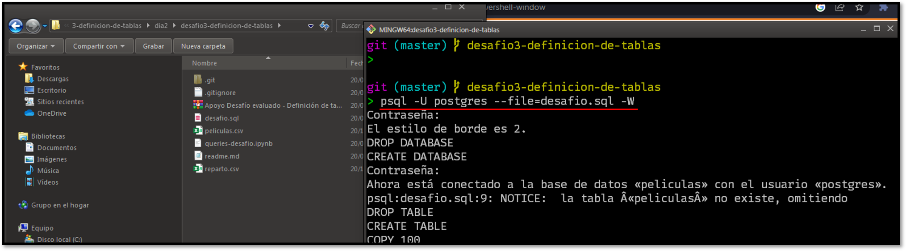

## DESAFIO 3 SQL - DEFINICIÓN DE TABLAS

- **Programa**: Fullstack Python - 007-1
- **Módulo**: M5 - Fundamentos de base de datos relacionales

---

### DBMS UTILIZADO

[](https://www.postgresql.org/)

---

### COMO EJECUTAR 

Descarga este repositorio.

Abre una terminal dentro de este proyecto y ejecuta el siguiente comando:  

```bash
psql -U postgres --file=desafio.sql -W
```



---

### JUPYTER NOTEBOOK EJECUTADO

[](queries-desafio.ipynb)

